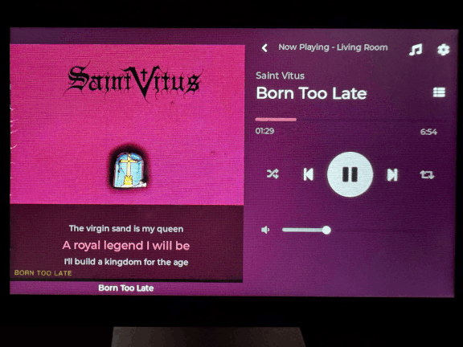
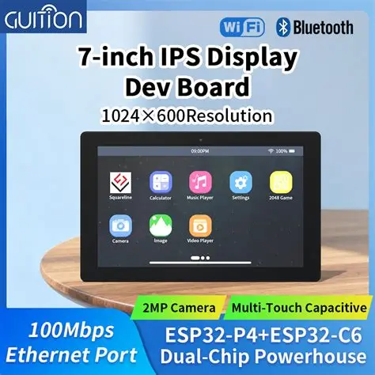

<div align="center">

# SonosESP | ESP32-P4 Sonos Controller

**A modern, touchscreen controller for Sonos speakers built with ESP32-P4**

[](https://opensource.org/licenses/MIT)
[](https://platformio.org/)
[](https://github.com/CoopsInChina/SonosESP/releases)
[](https://github.com/CoopsInChina/SonosESP/releases/latest)

[Features](#features) • [Hardware](#hardware) • [Installation](#installation) • [Contributing](#contributing)


</div>

---

## Features

- **Full Playback Control** - Play, pause, skip, volume, shuffle, and repeat
- **Queue Management** - Browse and manage your playback queue
- **Album Art Display** - Hardware JPEG decoder + PNG support with bilinear scaling and automatic dominant color extraction
- **Synced Lyrics Display** - Time-synced lyrics from LRCLIB overlaid on album art with smart auto-hide, scroll effects, and color matching
- **Clock Screensaver** - Full-screen clock activates after inactivity with random ambient background images, tap to dismiss
- **Photo Screensaver** - Local photos as clock screensaver backgrounds, embedded at build time via Python script for offline use without network dependency
- **Music Browsing** - Navigate your Sonos library, playlists, and favorites
- **Multi-Room** - Switch between Sonos zones with live playing indicators showing which rooms are active
- **OTA Updates** - Firmware updates from GitHub with Stable and Nightly release channel selection, auto-retry on low memory
- **Multi-Screen Support** - Supports both 4" 800×480 and 7" 1024×600 displays
- **Reliable Sonos Discovery** - Non-blocking deferred device discovery prevents UI freeze on startup; network mutex protection eliminates SDIO crash during concurrent WiFi operations
- **Weather Widget** - Live weather overlay on clock screensaver with temperature, humidity, wind speed, and conditions
- **Blurred Album Art Background** - Full-screen blurred background generated from album art for immersive experience



## Hardware

SonosESP supports two compatible development boards:

### 4" GUITION JC4880P433C


| Component | Specification |
|-----------|--------------|
| **MCU** | ESP32-P4 (400 MHz dual-core) |
| **WiFi Module** | ESP32-C6 (via ESP-Hosted) |
| **Display** | 800×480 RGB LCD with ST7701 driver |
| **Touch** | GT911 capacitive touch (I2C) |
| **Flash** | 16 MB |
| **PSRAM** | OPI PSRAM |
| **Interface** | USB-C |

### 7" GUITION JC1060P470C


| Component | Specification |
|-----------|--------------|
| **MCU** | ESP32-P4 (400 MHz dual-core) |
| **WiFi Module** | ESP32-C6 (via ESP-Hosted) |
| **Display** | 1024×600 RGB LCD with JD9165 driver |
| **Touch** | GT911 capacitive touch (I2C) |
| **Flash** | 16 MB |
| **PSRAM** | OPI PSRAM |
| **Interface** | USB-C |

> **Note:** The firmware includes conditional compilation for both screen sizes. Select the correct build environment in PlatformIO (`esp32_4inch` or `esp32_7inch`) for your hardware.


## Installation

### Web Installer (Recommended)
1. Visit the [Web Installer](https://CoopsInChina.github.io/SonosESP/)
2. Select your screen size (4" or 7")
3. Connect your ESP32-P4 via USB-C
4. Click "Install Firmware" and select the COM port
5. Wait for installation to complete
6. Configure WiFi using the on-screen keyboard after reboot

> Requires Chrome, Edge, or Opera browser with Web Serial support

### Manual Build with PlatformIO
For developers or custom configurations:

```bash
# Clone the repository
git clone -b release https://github.com/CoopsInChina/SonosESP.git
cd SonosESP

# Build for 4" screen
pio run -e esp32_4inch

# Build for 7" screen
pio run -e esp32_7inch

# Upload to device
pio run -e esp32_4inch -t upload
```

## OTA Updates (After Initial Install)
The device supports automatic Over-The-Air (OTA) firmware updates from GitHub releases:

1. Connect to WiFi via Settings
2. Navigate to Settings → Firmware Update
3. Tap "Check for Updates"
4. If an update is available, tap "Install Update"
5. Device will automatically download and install the correct firmware for your screen size

## First-Time Setup
1. **Power on** - Device will show WiFi setup if not configured
2. **WiFi Setup** - Tap "Scan" to find networks, select yours, enter password
3. **Sonos Discovery** - Navigate to Settings → Speakers and tap "Scan"
4. **Start Playing** - Select a device and start controlling your music!

## Photo Screensaver — Custom Photos

The screensaver background photos are embedded into the firmware at build time by `scripts/embed_photos.py`. The repository ships with generic placeholder images. You can replace them with your own photos.

### Using your own photos

Place three JPEG files named `Photo1.jpg`, `Photo2.jpg`, and `Photo3.jpg` into the appropriate directory for your screen size:

```
assets/
  4inchScreensavers/   ← photos for 4" builds (800×480 recommended)
  7inchScreensavers/   ← photos for 7" builds (1024×600 recommended)
```

Replace the existing files and rebuild. The script will embed them automatically.

### Keeping photos private (local builds only)

If you want to use personal photos locally without ever committing them to git, create a `PrivateAssets` folder inside `assets/`:

```
assets/
  PrivateAssets/
    4inchScreensavers/
      Photo1.jpg
      Photo2.jpg
      Photo3.jpg
    7inchScreensavers/
      Photo1.jpg
      Photo2.jpg
      Photo3.jpg
```

The build script automatically detects `assets/PrivateAssets/` and uses those photos instead of the public ones. The `PrivateAssets/` folder is listed in `.gitignore` and will never be committed — CI and public builds always use the generic photos from `assets/{size}inchScreensavers/`.

## Architecture

### Key Components
- **FreeRTOS Tasks** - Separate tasks for UI, album art, lyrics, and Sonos polling
- **Thread Safety** - Mutex protection for shared resources
- **Memory Management** - PSRAM for album art and lyrics, heap monitoring
- **Network Layer** - HTTPClient for SOAP requests, HTTPS for lyrics/art, UDP for SSDP discovery
- **UI Framework** - LVGL 9.4.0 with custom theme
- **Image Processing** - ESP32-P4 hardware JPEG decoder + software PNG decoder, custom bilinear scaling with fixed-point math
- **Lyrics System** - Time-synced LRC parsing with HTTPS fetching, auto-hide, and retry logic
- **Clock Screensaver** - Inactivity-triggered fullscreen clock with random background photos and weather widget
- **OTA Updates** - Stable and Nightly channels, 3-attempt retry loop with live countdown UI
- **Multi-Screen Support** - Conditional compilation for different display sizes and touch calibrations

## Configuration
WiFi credentials are stored persistently in NVS (Non-Volatile Storage). Once configured via the UI, they survive reboots and power cycles.

### Firmware Updates
- Automatic OTA updates from GitHub releases
- Separate firmware assets per screen size (`firmware-4inch.bin` / `firmware-7inch.bin`)
- Version checking on demand
- Progress indication during download
- Safe rollback on failure

## Known Issues
See the [GitHub Issues](https://github.com/CoopsInChina/SonosESP/issues) for current open issues.

## Thanks

This project is a fork of [SonosESP](https://github.com/OpenSurface/SonosESP) by [Opensurface](https://github.com/OpenSurface). All credit for the original concept, architecture, and implementation goes to them and their contributors:

- **[@pizza-init](https://github.com/pizza-init)** - Lead maintainer and feature developer
- **[@BaileyLawson](https://github.com/BaileyLawson)** - First external contributor
- **[@johnhenrick3-cpu](https://github.com/johnhenrick3-cpu)** - Outstanding community tester

Also, my inspiration for wanting to use this project in the first place came from this awesome project: 
This fork is really a personal project and is intended to be a mix between the the OpenSurface SONOS ESP, with a bigger screen support and the NFC tap function of this awesome project 
- **[@hankhank10](https://github.com/hankhank10)**'s Vinyl Emulator written for the Raspberry Pi.  which can be found here [Vinyl Emulator](https://github.com/hankhank10/vinylemulator), 

The NFC tap function within this project is 90% done, and will be released in the next week. 


## License
This project is licensed under the MIT License - see [LICENSE](LICENSE) file for details.

## Acknowledgments
- Built with [LVGL](https://lvgl.io/) - Amazing embedded graphics library
- [PlatformIO](https://platformio.org/) - Best embedded development platform
- [LRCLIB](https://lrclib.net/) - Free synced lyrics API
- [Unsplash](https://unsplash.com/) - Beautiful random background photos for the clock screensaver
- Sonos UPnP/SOAP API documentation and community
- Open-Meteo for free weather API

